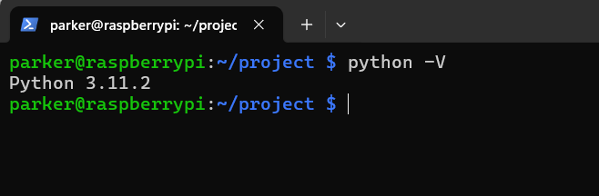
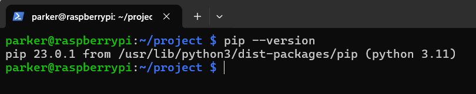
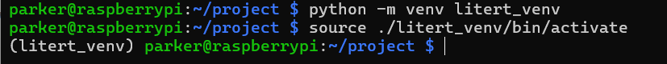
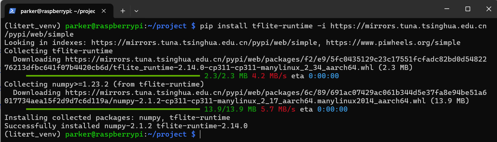
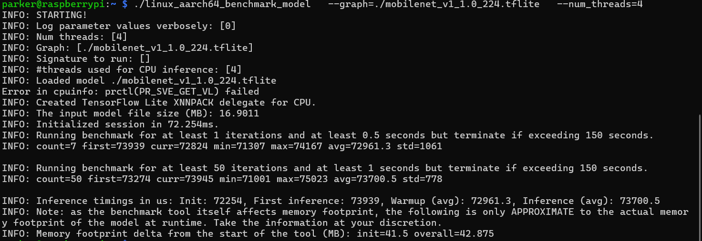

# Install TensorFlow Lite on your Raspberry Pi

In this tutorial, we're going to install the **TensorFlow Lite** on Raspberry Pi (Bookworm). I have a RPi 4 available, so the remaining part would be conducted on it.


The TensorFlow Lite is developed by google and has been widely used on many mobile devices (iOS, Android) or embedded devices (microcontrollers).

## Setup connections

If you have your raspberry pi connected to your router, you can use `ssh` to access the device:

```shell
ssh pi@raspberrypi.local
```

According to the instructions on terminal, type your password.

Once you connected your pi, we can begin the installation process.

Alternatively, you can use Real VNC or Raspberry Pi Connect to connect your device.

## Runtime Installation

Before we start, we should check if `Python` and `pip` are installed.

```shell
python -V
```


```shell
pip --version
```


In case that you haven't install Python and pip, please execute the following command to install them.

```Shell
sudo apt-get install python3 python3-pip -y
```

Then, we create a virtual environment:

```shell
python -m venv litert_venv
```

And activate the environment:

```shell
source ./litert_venv/bin/activate
```



We can install the `tflite-runtime` with pip:

```shell
pip install tflite-runtime
```


> [!NOTE] Enlarge your swap size (Optional)
> 
> In Raspberry Pi, you can edit the `/etc/dphys-swapfile`, change the number of `CONF_SWAPSIZE` and reboot your device to take effects.

## Verify the Installation

Now, we can create a simple program to check if TensorFlow Lite is correctly installed, but before we start, we may need some pre-trained model and some pictures for classification.

<!-- Todo: use the official benchmark on https://github.com/tensorflow/tensorflow/blob/master/tensorflow/lite/tools/benchmark/README.md  -->

Download the mobilenet model

```Shell
wget https://storage.googleapis.com/download.tensorflow.org/models/mobilenet_v1_2018_08_02/mobilenet_v1_1.0_224.tgz
```

Decompress the tarball

```Shell
tar xvf mobilenet_v1_1.0_224.tgz
```


## Benchmark (Optional)

We can use the pre-built [benchmark app](https://ai.google.dev/edge/litert/models/measurement) for some easy benchmark.

Download the pre-built benchmark binary

```Shell
wget https://storage.googleapis.com/tensorflow-nightly-public/prod/tensorflow/release/lite/tools/nightly/latest/linux_aarch64_benchmark_model
```

Give the app permission to execute

```Shell
chmod +x ./linux_aarch64_benchmark_model
```


Run benchmark

```Shell
./linux_aarch64_benchmark_model \
  --graph=./mobilenet_v1_1.0_224.tflite \
  --num_threads=4
```
And the running screenshot



